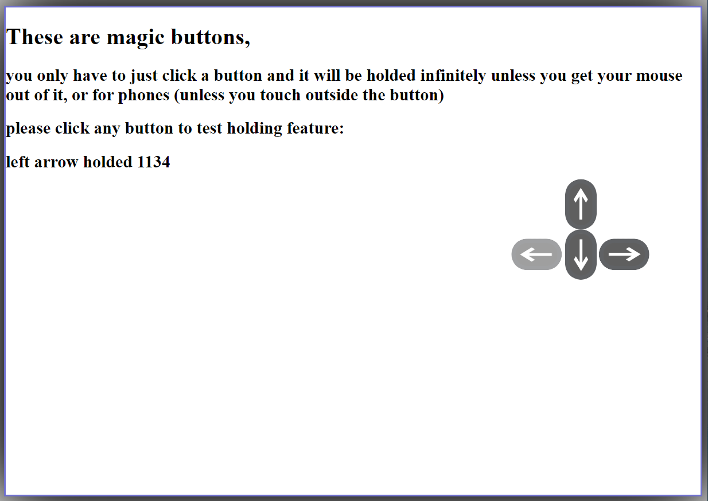

# Front-End-Auto-Holding-Buttons-
*using **HTML, CSS and JavaScript** to build auto holders buttons.
These buttons interact **"holding event"** with just one click/touch for pc/phone user.
So you can use  it; applying it to your preferred design,
and yeah! enjoy (((:*

***and here is a preview image of how the project looks like:***

__________________________________________________________________________
